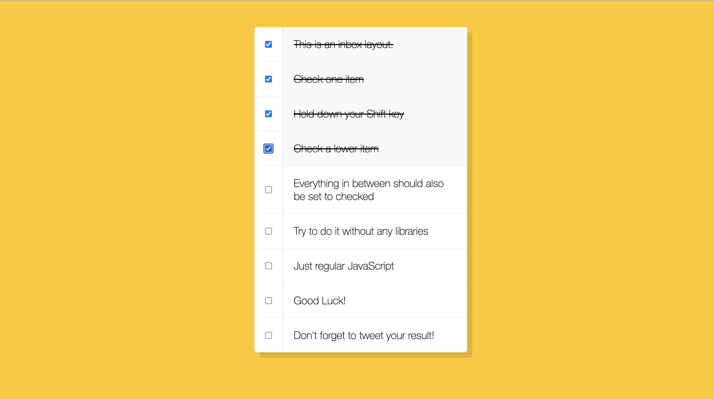

# Hold_Shift_Check_Checkboxes

This is a 30-days javascript grinding  
js30 [https://github.com/ningh98/js30]  
10. Hold_Shift_Check_Checkboxes [https://github.com/ningh98/Hold_Shift_Check_Checkboxes]

## Table of contents

- [Overview](#overview)
  - [Screenshot](#screenshot)
  - [Links](#links)
- [My process](#my-process)
  - [Built with](#built-with)
  - [What I learned](#what-i-learned)


## Overview

It demonstrates a functionality where holding the Shift key while selecting multiple checkboxes allows the user to check all boxes in between the first and the last selected checkbox.

### Screenshot




### Links

- Live Site URL: [https://ningh98.github.io/Hold_Shift_Check_Checkboxes/]

## My process

### Built with

- HTML
- CSS
- Javascript


### What I learned


```js
const checkboxes = document.querySelectorAll('.inbox input[type="checkbox"]')

let lastChecked
function handleCheck(e) {
// check if shift key down
//and check that they are checking it
let inBetween = false
if (e.shiftKey && this.checked){
    checkboxes.forEach(checkbox => {
    console.log(checkbox)
    if(checkbox === this || checkbox === lastChecked){
        inBetween = !inBetween
        console.log('this is in between elements')
    }
    if(inBetween){
        checkbox.checked = true
    }
    })
}
lastChecked = this
}
checkboxes.forEach(checkbox => checkbox.addEventListener('click', handleCheck))
```

